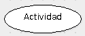
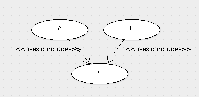
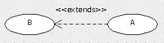
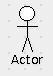
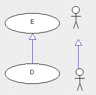
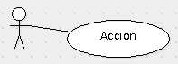

# Intro
En España se hizo METRICA2 (prog estructurada) y METRICA3 (tb para objetos)
La documentación esta muy bien

# Casos de uso
- Especifica el comportamiento deseado del sistema

# Diagrama de Casos de Uso
- Representa **requisitos funcionales** del sistema
- "_un caso de uso especifica un **conjutno de secuencias de acciones**, incluyendo **variantes**, que el **sistema puede ejecutar** y produce un resultado observable de valor para un particular actor_
- Describen _qué_ hace el sistema, no _cómo_ lo hace

## Actividad
- actividades de la empresa
- Verbos en infinitivo por que implican acción

## <<uses\>\> ó <<includes\>\>
- **Caracter obligatorio**
- Interacciones llevada a cabo por actores __relación unidireccional__
- Comportamiento común entre varios Casos de uso
- (se parece a una llamada a subrutina)

## <<extends\>\>
- **Caracter opcional**
- Se lee al revés
- Habla de __especialización__
- Parecido a herencia de objetos

## actor
- __Interactua__ con la aplicación
- persona, entidad, 'cosa' suele ser un humano pero puede ser por ej: un servidor de correo. 

## generalización "herencia"

## interacción

## LINKS
[I'm an inline-style link](https://www.google.com)
